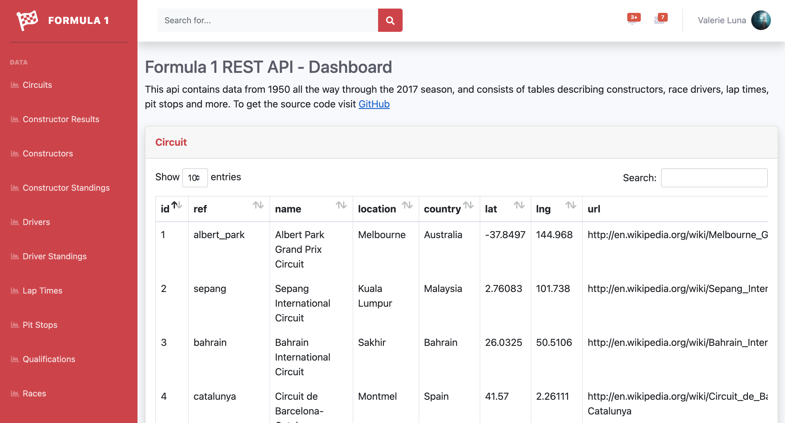

# Formula 1 Application - RESTfull API & Dashboard
This API contains data from 1950 all the way through the 2017 season, and consists of tables describing constructors, race drivers, lap times, pit stops and more.

## Preview
Dashboard             |  API
:-------------------------:|:-------------------------:
 | 

## Getting Started

These instructions will get you a copy of the project up and running on your local machine.

### Prerequisites

Make sure you have docker installed and the ports 80 & 443 are available on your development machine.

Make sure you have installed all of the following prerequisites on your development machine:
* Git - [Download & Install Git](https://git-scm.com/downloads)
* Docker - [Download & Install Docker](https://www.docker.com/products/docker-desktop)

### Installing

Once you've satisfied the prerequisites, run the following command to clone the repository:
```
git clone https://github.com/Darrellrp/Formula-1-App.git
```

## Running the applications

Go into the application folder and run the following command to start the applications:
```
docker-compose up -d
```

Now that the applications are running, open your browser and go to the URLs below:

API
```
https://localhost/api
```

Web
```
https://localhost
```